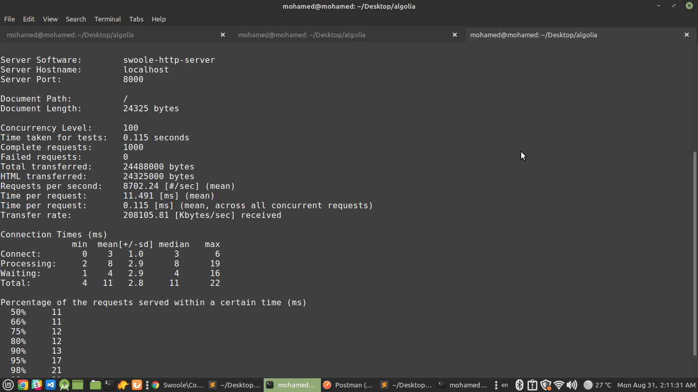
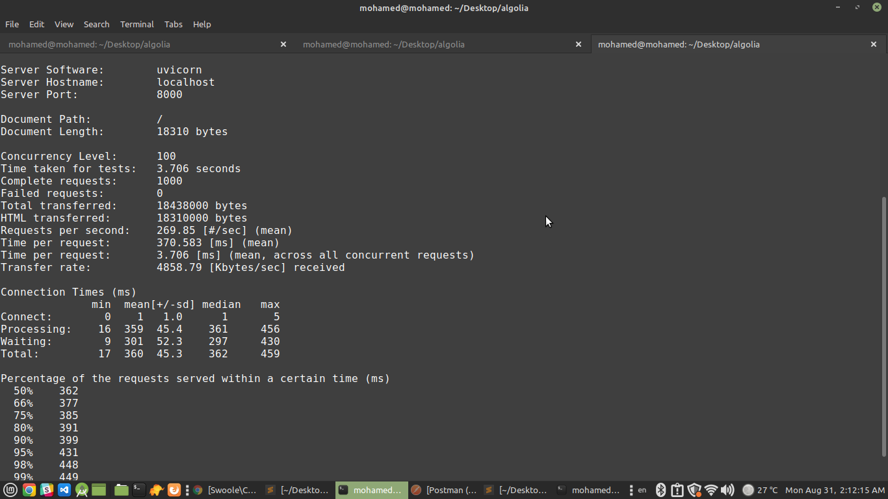

# FastApi
PHP Micro framework based on swoole php extension.

## Requirements
- Swoole PHP Extension
```
sudo pecal install swoole
```

## Installation
```
git clone https://github.com/mohamed-samir907/FastApi.git
```

## Benchmarking (python requirements)
Benchmarking with Python FastApi microframework.

- Install pip3
```
sudo apt-get install python3-pip
```
- Install FastApi framework and server for it
```
pip3 install fastapi

pip3 install uvicorn
```

- Run main.py like this command:
```
uvicorn main:app --reload
```

- PHP


- Python
